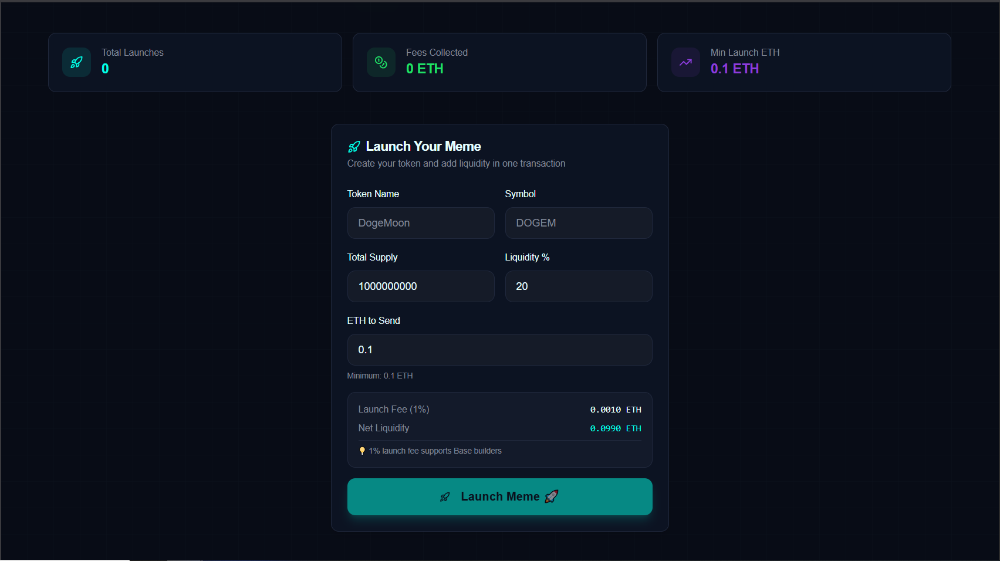
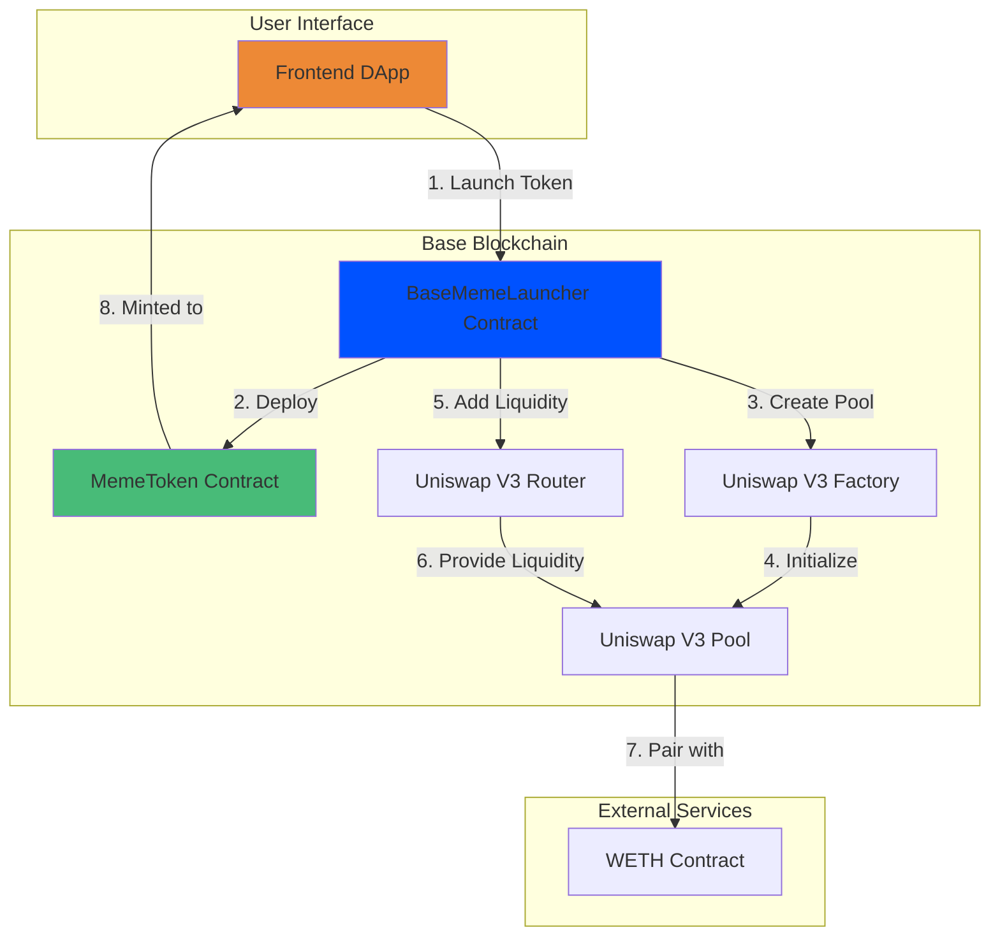
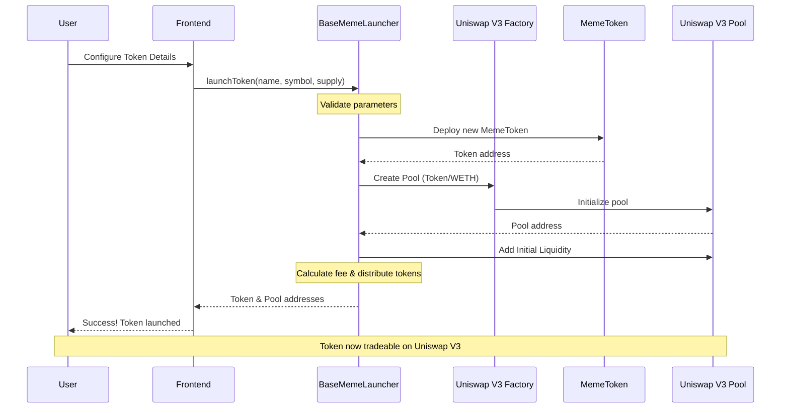
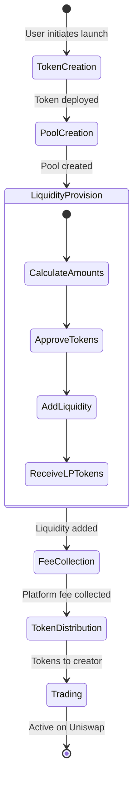
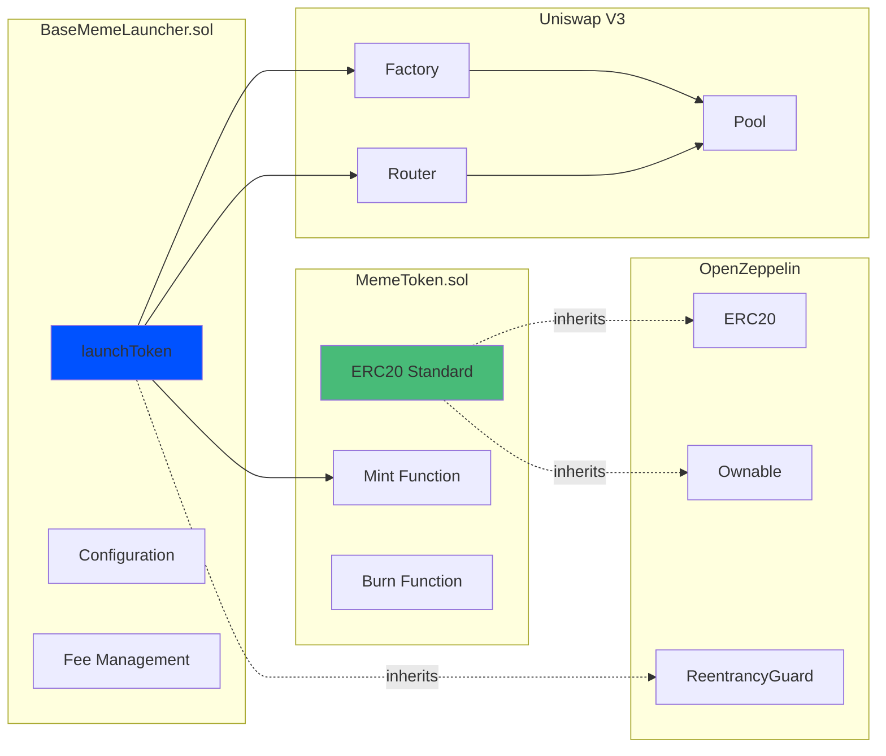

# Base Meme Launcher

<div align="center">




**A decentralized meme token launcher on Base blockchain with automated Uniswap V3 integration**

[Documentation](#documentation) • [Quick Start](#quick-start) • [Architecture](#architecture) • [Smart Contracts](solidityContract/) • [Contributing](#contributing)

</div>

---

## Table of Contents

- [Base Meme Launcher](#base-meme-launcher)
  - [Table of Contents](#table-of-contents)
  - [Overview](#overview)
    - [Why Base Meme Launcher?](#why-base-meme-launcher)
  - [Features](#features)
    - [Core Functionality](#core-functionality)
    - [Smart Contract Features](#smart-contract-features)
    - [Coming Soon](#coming-soon)
  - [Architecture](#architecture)
    - [System Architecture](#system-architecture)
    - [Token Launch Flow](#token-launch-flow)
    - [Liquidity Management](#liquidity-management)
    - [Smart Contract Interaction](#smart-contract-interaction)
  - [Smart Contracts](#smart-contracts)
    - [Core Contracts](#core-contracts)
    - [Key Functions](#key-functions)
      - [BaseMemeLauncher](#basememelauncher)
      - [MemeToken](#memetoken)
  - [Getting Started](#getting-started)
    - [Prerequisites](#prerequisites)
    - [Installation](#installation)
    - [Configuration](#configuration)
  - [Usage](#usage)
    - [Deploying Contracts](#deploying-contracts)
      - [Deploy to Base Testnet](#deploy-to-base-testnet)
      - [Deploy to Base Mainnet](#deploy-to-base-mainnet)
    - [Launching a Meme Token](#launching-a-meme-token)
  - [Frontend](#frontend)
  - [For Builders](#for-builders)
    - [Development Workflow](#development-workflow)
    - [Testing](#testing)
    - [Deployment](#deployment)
    - [Project Structure](#project-structure)
  - [For Learners](#for-learners)
    - [Understanding the Code](#understanding-the-code)
    - [Key Concepts](#key-concepts)
      - [1. **ERC-20 Tokens**](#1-erc-20-tokens)
      - [2. **Uniswap V3 Integration**](#2-uniswap-v3-integration)
      - [3. **Access Control**](#3-access-control)
      - [4. **Reentrancy Protection**](#4-reentrancy-protection)
      - [5. **Factory Pattern**](#5-factory-pattern)
    - [Learning Resources](#learning-resources)
    - [Study Path](#study-path)
  - [Security](#security)
    - [Best Practices Implemented](#best-practices-implemented)
    - [Security Considerations](#security-considerations)
    - [Reporting Security Issues](#reporting-security-issues)
  - [Contributing](#contributing)
    - [Contribution Guidelines](#contribution-guidelines)
  - [License](#license)
  - [Contact](#contact)
  - [Acknowledgments](#acknowledgments)

---

## Overview

**Base Meme Launcher** is a comprehensive platform for launching meme tokens on the Base blockchain with automated liquidity provision on Uniswap V3. This project combines smart contract infrastructure with a user-friendly frontend to democratize token creation and distribution.

### Why Base Meme Launcher?

- **No-Code Token Creation**: Launch ERC-20 tokens without writing a single line of Solidity
- **Automated Liquidity**: Seamless Uniswap V3 pool creation and liquidity provision
- **Low Fees**: Built on Base for minimal gas costs
- **Secure**: Audited smart contracts with reentrancy protection
- **Open Source**: Fully transparent and community-driven

---

## Features

### Core Functionality
- One-click meme token deployment
- Automatic Uniswap V3 pool creation
- Configurable initial supply and distribution
- Built-in liquidity management
- Fee collection mechanism for platform sustainability
- Reentrancy protection and security best practices

### Smart Contract Features
- ERC-20 compliant meme tokens
- Owner-controlled minting capabilities
- Token burning functionality
- Integration with OpenZeppelin contracts
- Foundry-based testing and deployment

### Coming Soon
- Frontend interface (React/Next.js)
- Token analytics dashboard
- Social features and token discovery
- Advanced liquidity strategies

---

## Architecture

### System Architecture



### Token Launch Flow



### Liquidity Management



### Smart Contract Interaction



---

## Smart Contracts

The smart contract infrastructure is located in the [`solidityContract/`](solidityContract/) directory.

### Core Contracts

| Contract | Description | Location |
|----------|-------------|----------|
| **BaseMemeLauncher** | Main launcher contract for deploying and managing meme tokens | [src/BaseMemeLauncher.sol](solidityContract/src/BaseMemeLauncher.sol) |
| **MemeToken** | ERC-20 token template for meme tokens | [src/MemeToken.sol](solidityContract/src/MemeToken.sol) |

### Key Functions

#### BaseMemeLauncher
```solidity
function launchToken(
    string memory name,
    string memory symbol,
    uint256 initialSupply,
    uint256 liquidityPercentage
) external payable returns (address tokenAddress, address poolAddress)
```

#### MemeToken
```solidity
function mint(address to, uint256 amount) public onlyOwner
function burn(uint256 amount) public
```

**[View Full Contract Documentation](solidityContract/README.md)**

---

## Getting Started

### Prerequisites

Before you begin, ensure you have the following installed:

- **Git**: Version control
- **Foundry**: Ethereum development toolkit
  ```bash
  curl -L https://foundry.paradigm.xyz | bash
  foundryup
  ```
- **Node.js**: v18+ (for frontend)
- **Wallet**: MetaMask or similar Web3 wallet

### Installation

1. **Clone the repository**
   ```bash
   git clone https://github.com/yourusername/memeLauncher.git
   cd memeLauncher
   ```

2. **Install smart contract dependencies**
   ```bash
   cd solidityContract
   forge install
   ```

3. **Install frontend dependencies** (when available)
   ```bash
   cd frontend
   npm install
   ```

### Configuration

1. **Set up environment variables**
   ```bash
   cp .env.example .env
   ```

2. **Configure your .env file**
   ```env
   PRIVATE_KEY=your_private_key_here
   BASE_RPC_URL=https://mainnet.base.org
   BASESCAN_API_KEY=your_basescan_api_key
   ```

3. **Fund your deployment wallet**
   - Ensure your wallet has ETH on Base for gas fees

---

## Usage

### Deploying Contracts

#### Deploy to Base Testnet
```bash
cd solidityContract
./deploy-testnet.sh
```

#### Deploy to Base Mainnet
```bash
cd solidityContract
./deploy-mainnet.sh
```

### Launching a Meme Token

```javascript
// Example interaction with the launcher
const tx = await baseMemeLauncher.launchToken(
  "MyMeme",           // Token name
  "MEME",             // Token symbol
  1000000000,         // Initial supply (1B tokens)
  50,                 // 50% to liquidity pool
  { value: ethers.utils.parseEther("0.1") } // ETH for liquidity
);
```

---

## Frontend

The frontend application will provide a user-friendly interface for:
- Connecting Web3 wallets
- Configuring token parameters
- Launching tokens with one click
- Viewing created tokens and analytics

**Status**: Coming Soon

---

## For Builders

### Development Workflow

1. **Make changes to smart contracts**
   ```bash
   cd solidityContract
   ```

2. **Run tests**
   ```bash
   forge test
   forge test -vvv  # Verbose output
   ```

3. **Check coverage**
   ```bash
   forge coverage
   ```

4. **Format code**
   ```bash
   forge fmt
   ```

### Testing

Comprehensive test suite located in [`solidityContract/test/`](solidityContract/test/)

```bash
# Run all tests
forge test

# Run specific test
forge test --match-test testLaunchToken

# Run with gas reports
forge test --gas-report
```

### Deployment

```bash
# Dry run deployment
forge script script/DeployMemeLauncher.s.sol --rpc-url $BASE_RPC_URL

# Deploy and verify
forge script script/DeployMemeLauncher.s.sol --rpc-url $BASE_RPC_URL --broadcast --verify
```

### Project Structure
```
memeLauncher/
├── solidityContract/          # Smart contracts
│   ├── src/                   # Contract source files
│   ├── test/                  # Test files
│   ├── script/                # Deployment scripts
│   └── lib/                   # Dependencies
├── frontend/                  # Frontend application (coming soon)
└── docs/                      # Additional documentation
```

---

## For Learners

### Understanding the Code

This project is an excellent learning resource for:
- **Solidity Development**: Learn smart contract patterns
- **DeFi Integration**: Understand Uniswap V3 integration
- **Token Economics**: Explore tokenomics and liquidity
- **Testing**: Foundry testing best practices
- **Deployment**: Learn deployment strategies

### Key Concepts

#### 1. **ERC-20 Tokens**
MemeToken implements the ERC-20 standard, the most common token standard on Ethereum and Base.

#### 2. **Uniswap V3 Integration**
Learn how to programmatically create liquidity pools and provide liquidity.

#### 3. **Access Control**
Uses OpenZeppelin's Ownable for secure contract ownership.

#### 4. **Reentrancy Protection**
Implements ReentrancyGuard to prevent reentrancy attacks.

#### 5. **Factory Pattern**
The launcher uses the factory pattern to deploy multiple token contracts.

### Learning Resources

- [Solidity Documentation](https://docs.soliditylang.org/)
- [Foundry Book](https://book.getfoundry.sh/)
- [OpenZeppelin Contracts](https://docs.openzeppelin.com/contracts/)
- [Uniswap V3 Documentation](https://docs.uniswap.org/contracts/v3/overview)
- [Base Documentation](https://docs.base.org/)

### Study Path

1. **Beginner**: Start with [MemeToken.sol](solidityContract/src/MemeToken.sol)
2. **Intermediate**: Explore [BaseMemeLauncher.sol](solidityContract/src/BaseMemeLauncher.sol)
3. **Advanced**: Study Uniswap V3 integration and liquidity math
4. **Expert**: Analyze test cases and security patterns

---

## Security

### Best Practices Implemented

- ReentrancyGuard on all state-changing functions
- Input validation and require statements
- OpenZeppelin audited contracts
- Comprehensive test coverage
- No hardcoded values for critical parameters

### Security Considerations

**This is educational software. Use at your own risk.**

- Contracts are not audited for production use
- Always test on testnet before mainnet deployment
- Be cautious with private keys and sensitive data
- Understand smart contract risks before deploying

### Reporting Security Issues

If you discover a security vulnerability, please email: security@yourproject.com

---

## Contributing

We welcome contributions from the community! Here's how you can help:

1. **Fork the repository**
2. **Create a feature branch** (`git checkout -b feature/amazing-feature`)
3. **Commit your changes** (`git commit -m 'Add amazing feature'`)
4. **Push to the branch** (`git push origin feature/amazing-feature`)
5. **Open a Pull Request**

### Contribution Guidelines

- Follow the existing code style
- Add tests for new features
- Update documentation as needed
- Keep commits atomic and well-described

---

## License

This project is licensed under the MIT License - see the [LICENSE](LICENSE) file for details.

---

## Contact

- **GitHub**: [Your GitHub Profile](https://github.com/yourusername)
- **Twitter**: [@YourTwitter](https://twitter.com/yourhandle)
- **Discord**: [Join our Discord](https://discord.gg/yourserver)
- **Email**: contact@yourproject.com

---

## Acknowledgments

- [OpenZeppelin](https://openzeppelin.com/) for secure smart contract libraries
- [Foundry](https://getfoundry.sh/) for the amazing development toolkit
- [Uniswap](https://uniswap.org/) for the decentralized exchange protocol
- [Base](https://base.org/) for the L2 blockchain infrastructure

---

<div align="center">

**Built with love for the Base community**

Star this repo if you find it useful!

</div>
