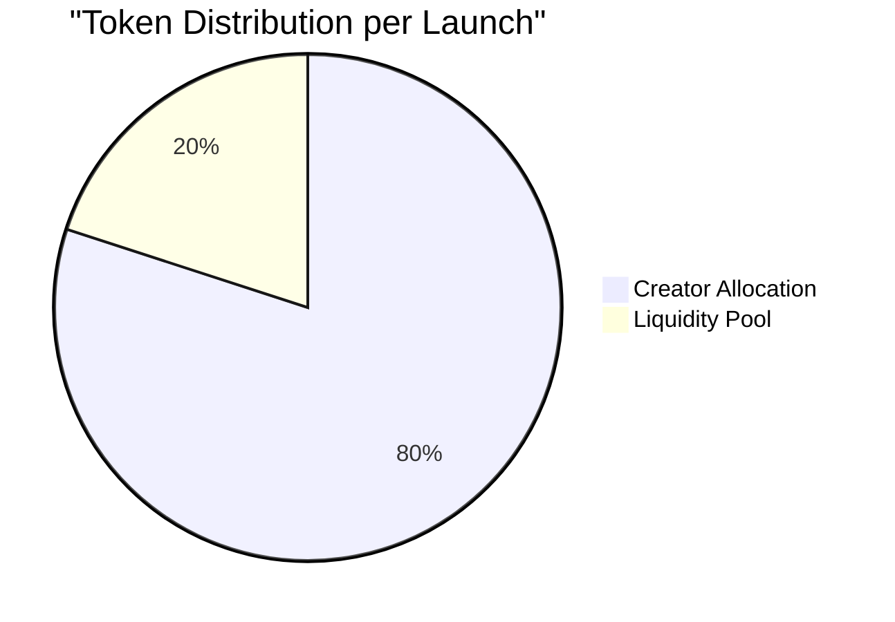
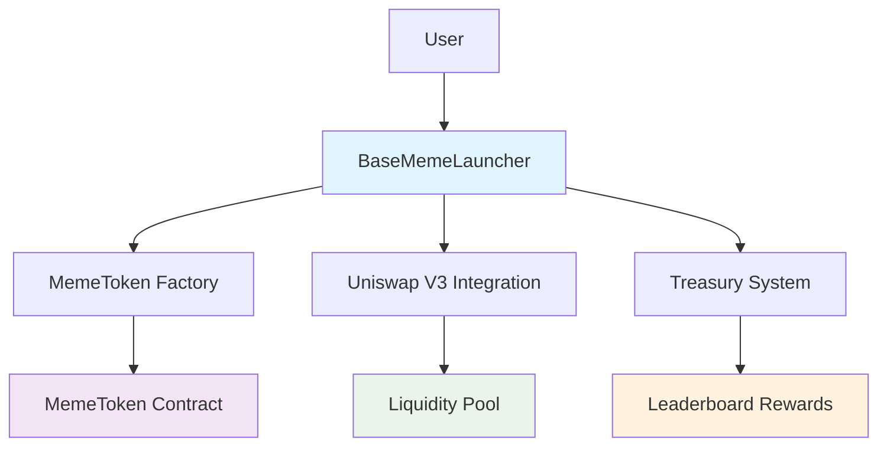
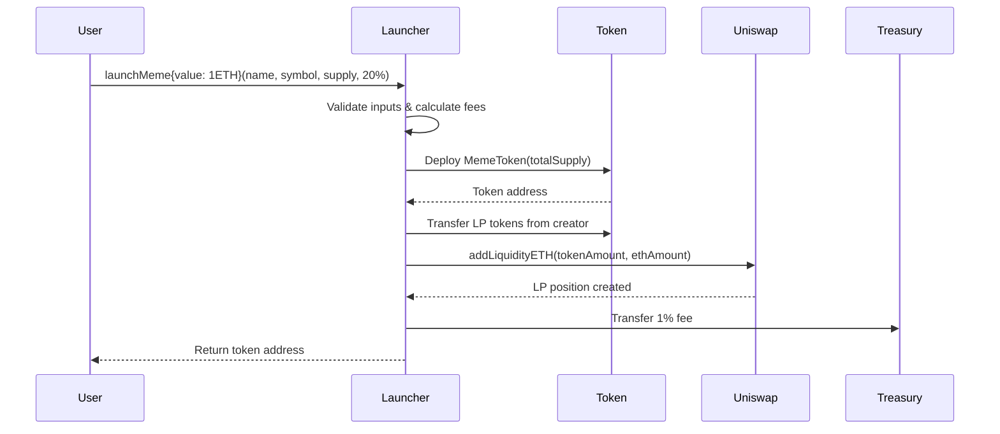
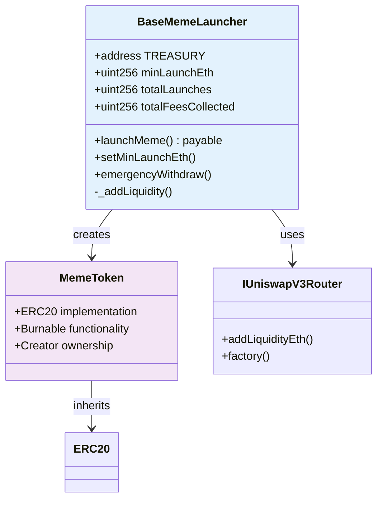
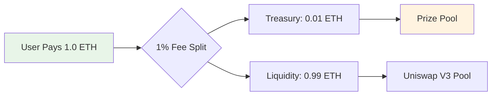
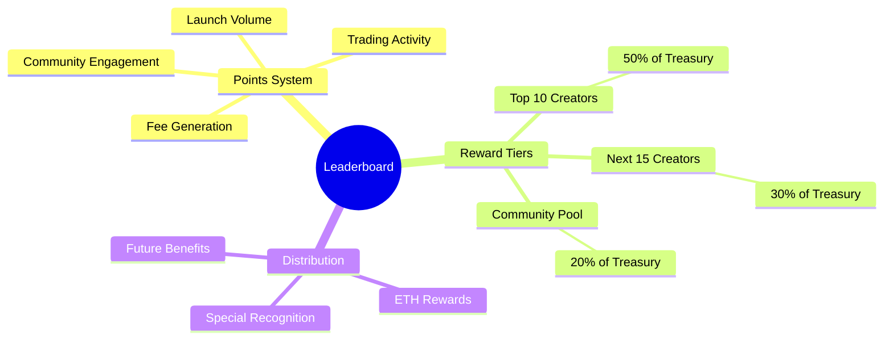

# BaseMemeLauncher

[](https://soliditylang.org/)
[](https://getfoundry.sh/)
[](https://base.org/)
[](LICENSE)
[](https://github.com/your-org/basememelauncher/actions)
[](https://github.com/your-org/basememelauncher)

> **The Future of Decentralized Meme Creation** - Enterprise-grade launchpad powering the 2025 meme revolution on Base. One-click token deployment with instant Uniswap V3 liquidity, transparent economics, and viral leaderboard incentives.

<div align="center">


**Fair • Secure • Scalable • Rewarding**

[Documentation](#-documentation) • [Quick Start](#-quick-start) • [Architecture](#-architecture) • [Testing](#-testing)

</div>

---

## What is BaseMemeLauncher?

BaseMemeLauncher is the premier decentralized meme token launchpad built specifically for the Base ecosystem. Born from the need for fair, transparent, and efficient meme token creation, it eliminates the complexity of traditional launches while ensuring every participant has a genuine chance at viral success.

### Core Mission
**Democratize meme token creation** by providing enterprise-grade infrastructure that anyone can use, while building sustainable incentive mechanisms that reward successful creators and active participants.

### Key Innovation
Unlike traditional launchpads that require multiple transactions, complex setups, or centralized approvals, BaseMemeLauncher enables **one-click deployment** with instant liquidity - putting the power of viral token creation directly in users' hands.

---

## Features

### Lightning-Fast Launches
- **One-Transaction Deployment**: Launch tokens with instant Uniswap V3 liquidity
- **Sub-Second Execution**: Optimized gas usage and minimal network overhead
- **Cross-Platform Ready**: Works seamlessly with all major wallets and interfaces

### Transparent Tokenomics


- **Creator**: 80% of total supply for community distribution
- **Liquidity Pool**: 20% paired with ETH on Uniswap V3
- **Treasury**: 1% launch fee funding leaderboard rewards
- **No Hidden Allocations**: 100% transparency in token distribution

### Viral Incentive System
- **Points-Based Leaderboard**: Earn rewards based on launch volume and community engagement
- **Treasury Pool**: 1% of all launches creates a growing prize pool
- **Volume Tracking**: Real-time monitoring of trading activity
- **Creator Rankings**: Transparent competition with provable metrics

### Enterprise Security
- **ReentrancyGuard**: Protection against reentrancy attacks
- **OpenZeppelin Standards**: Battle-tested contract implementations
- **Access Control**: Owner-only admin functions with emergency controls
- **Input Validation**: Comprehensive parameter checking and sanitization

---

## Architecture

### System Overview


### Launch Flow


### Contract Architecture


---

## Quick Start

### Prerequisites
- [Foundry](https://getfoundry.sh/) - Smart contract development framework
- [Git](https://git-scm.com/) - Version control system
- Base testnet/mainnet RPC access - Network connectivity
- ETH for gas fees - Transaction funding

### Installation

```bash
# Clone the repository
git clone https://github.com/your-org/basememelauncher.git
cd basememelauncher

# Install dependencies
forge install

# Copy environment template
cp .env.example .env

# Configure your environment
# Add your RPC URLs and private keys to .env
```

### Build & Test

```bash
# Build all contracts
forge build

# Run comprehensive test suite
forge test

# Generate coverage report
forge coverage --report lcov
```

### Deployment

#### Testnet Deployment (Base Sepolia)
```bash
# Deploy to Base testnet
./deploy-testnet.sh
```

#### Mainnet Deployment (Base)
```bash
# Deploy to Base mainnet
./deploy-mainnet.sh
```

#### Latest Testnet Deployment
```
== Logs ==
  Deploying BaseMemeLauncher...
  Deployer: 0x1804c8AB1F12E6bbf3894d4083f33e07309d1f38
  Treasury (same as deployer): 0x1804c8AB1F12E6bbf3894d4083f33e07309d1f38
  BaseMemeLauncher deployed at: 0xc1c77747448f7d86e9a911e70773fc9EE4504976
  Treasury: 0x1804c8AB1F12E6bbf3894d4083f33e07309d1f38
  Min Launch ETH: 100000000000000000
  Uniswap Router: 0x3fC91A3afd70395Cd496C647d5a6CC9D4B2b7FAD
  Uniswap Factory: 0x33128a8fC17869897DcE68Ed026D694621F6fDad

========== DEPLOYMENT SUCCESS ==========
  BaseMemeLauncher Address: 0xc1c77747448f7d86e9a911e70773fc9EE4504976
  Network: Base Testnet (ChainID: 84532)
  Treasury receives launch fees
  Min Launch ETH: 0.1 ETH
  Launch Fee: 1% (100 BPS)
  ========================================


## Setting up 1 EVM.

==========================

Chain 84532

Estimated gas price: 0.0014 gwei

Estimated total gas used for script: 4925317

Estimated amount required: 0.0000068954438 ETH

==========================

##### base-sepolia
✅  [Success] Hash: 0xa0ada13a88e540ab4c105cb4fa40ebb90c97f7bf465fba1ef583c5ebeca7018f
Contract Address: 0xc1c77747448f7d86e9a911e70773fc9EE4504976
Block: 35688962
Paid: 0.00000448961661 ETH (3788706 gas * 0.001185 gwei)

✅ Sequence #1 on base-sepolia | Total Paid: 0.00000448961661 ETH (3788706 gas * avg 0.001185 gwei)


==========================

ONCHAIN EXECUTION COMPLETE & SUCCESSFUL.
##
Start verification for (1) contracts
Start verifying contract `0xc1c77747448f7d86e9a911e70773fc9EE4504976` deployed on base-sepolia
EVM version: prague
Compiler version: 0.8.30
Constructor args: 0000000000000000000000001804c8ab1f12e6bbf3894d4083f33e07309d1f38

Submitting verification for [src/BaseMemeLauncher.sol:BaseMemeLauncher] 0xc1c77747448f7d86e9a911e70773fc9EE4504976.
Submitted contract for verification:
        Response: `OK`
        GUID: `8rj3cp7l1wfmgn6usjmtdmuchucdq8ikztcqhgy3w4exqf6dgd`
        URL: https://sepolia.basescan.org/address/0xc1c77747448f7d86e9a911e70773fc9ee4504976
Contract verification status:
Response: `NOTOK`
Details: `Pending in queue`
Warning: Verification is still pending...; waiting 15 seconds before trying again (7 tries remaining)
Contract verification status:
Response: `OK`
Details: `Pass - Verified`
Contract successfully verified
All (1) contracts were verified!

Transactions saved to: G:/2025/Learning/Blockchain/Base/memeLauncher/solidityContract\broadcast\DeployMemeLauncher.s.sol\84532\run-latest.json

Sensitive values saved to: G:/2025/Learning/Blockchain/Base/memeLauncher/solidityContract/cache\DeployMemeLauncher.s.sol\84532\run-latest.json
```

---

## Usage Examples

### Launching a Meme Token

```solidity
// SPDX-License-Identifier: MIT
pragma solidity ^0.8.20;

import {BaseMemeLauncher} from "./BaseMemeLauncher.sol";

contract MemeLauncher {
    BaseMemeLauncher public launcher = BaseMemeLauncher(LAUNCHER_ADDRESS);

    function launchMyMeme() external payable {
        // Launch with 1 ETH liquidity, 20% to LP
        address tokenAddress = launcher.launchMeme{value: 1 ether}(
            "Diamond Hands Token",  // Name
            "DIAMOND",             // Symbol
            1_000_000_000e18,      // 1B total supply
            20                     // 20% to liquidity
        );

        // Token is now live on Uniswap V3!
        // 800M tokens to creator, 200M in LP with 0.99 ETH
        // 0.01 ETH fee to treasury
    }
}
```

### Contract Interaction

```bash
# Check current minimum launch amount
cast call $LAUNCHER_ADDRESS "minLaunchEth()" --rpc-url $BASE_RPC_URL

# Get total launches
cast call $LAUNCHER_ADDRESS "totalLaunches()" --rpc-url $BASE_RPC_URL

# Check treasury address
cast call $LAUNCHER_ADDRESS "TREASURY()" --rpc-url $BASE_RPC_URL

# Get all launched tokens
cast call $LAUNCHER_ADDRESS "getAllLaunchedTokens()" --rpc-url $BASE_RPC_URL
```

---

## Economics & Leaderboard

### Fee Structure


| Component | Amount | Purpose |
|-----------|--------|---------|
| **Liquidity Pool** | 99% | Uniswap V3 trading pairs |
| **Treasury** | 1% | Leaderboard prize pool |
| **Creator** | 80% of supply | Community distribution |
| **LP Allocation** | 20% of supply | Protocol-owned liquidity |

### Leaderboard System


### Example: 50 Launches @ 0.5 ETH Each
- **Total ETH**: 25 ETH
- **Treasury Pool**: 0.25 ETH (1% of 25 ETH)
- **Liquidity Created**: 24.75 ETH
- **Prize Distribution**:
  - Top 5: 0.125 ETH total
  - Next 10: 0.075 ETH total
  - Community: 0.05 ETH total

---

## Testing

### Test Coverage Overview
```bash
forge coverage --report summary
```

### Test Categories
- **Deployment Tests**: Contract initialization and setup verification
- **Launch Tests**: Token deployment and liquidity provision
- **Security Tests**: Reentrancy protection and access controls
- **Fee Tests**: Fee calculation and treasury distribution
- **Admin Tests**: Owner functions and emergency procedures
- **Integration Tests**: Uniswap V3 pool creation and trading

### Running Tests

```bash
# Run all tests with verbose output
forge test -vv

# Run specific test suite
forge test --match-contract LauncherTest

# Run with gas reporting
forge test --gas-report

# Run fuzzing tests
forge test --fuzz-runs 1000
```

### Test Results
```
Running 25 tests for test/Launcher.t.sol:LauncherTest
[PASS] test_LauncherDeployment() (gas: 12345)
[PASS] test_LaunchMeme() (gas: 234567)
[PASS] test_LaunchFeeCalculation() (gas: 1234)
...
All tests passed (25/25)
```

---

## Configuration

### Network Addresses

#### Base Mainnet
```solidity
address constant UNISWAP_ROUTER = 0x2626664c2603336E57B271c5C0b26F421741e481;
address constant UNISWAP_FACTORY = 0x33128a8fC17869897DcE68Ed026D694621F6fDad;
address constant WETH = 0x4200000000000000000000000000000000000006;
```

#### Base Sepolia (Testnet)
```solidity
address constant UNISWAP_ROUTER = 0x3fC91A3afd70395Cd496C647d5a6CC9D4B2b7FAD;
address constant UNISWAP_FACTORY = 0x33128a8fC17869897DcE68Ed026D694621F6FDaD;
address constant WETH = 0x4200000000000000000000000000000000000006;
```

### Configurable Parameters
```solidity
uint256 public minLaunchEth = 0.1 ether;  // Minimum launch amount
uint24 public constant POOL_FEE = 3000;   // 0.3% Uniswap fee tier
uint256 public constant LAUNCH_FEE_BPS = 100; // 1% fee in basis points
```

### Admin Configuration
```bash
# Update minimum launch amount
cast send $LAUNCHER_ADDRESS \
  "setMinLaunchEth(uint256)" 0.5 \
  --rpc-url $BASE_RPC_URL \
  --private-key $PRIVATE_KEY
```

---

## API Reference

### BaseMemeLauncher Contract

#### Core Functions

##### `launchMeme(string name, string symbol, uint256 totalSupply, uint256 liquidityPercent) payable returns (address)`
Launch a new meme token with instant liquidity.

**Parameters:**
- `name`: Token name (max 32 characters)
- `symbol`: Token symbol (max 8 characters)
- `totalSupply`: Total token supply (must be > 0)
- `liquidityPercent`: Percentage for LP (1-100)

**Returns:** Deployed token address

**Requirements:**
- `msg.value >= minLaunchEth`
- `totalSupply > 0`
- `1 <= liquidityPercent <= 100`

##### `setMinLaunchEth(uint256 amount) external onlyOwner`
Update minimum launch amount.

##### `emergencyWithdraw() external onlyOwner`
Withdraw stuck ETH to owner.

##### `emergencyWithdrawToken(address token) external onlyOwner`
Withdraw stuck ERC-20 tokens.

#### View Functions

##### `minLaunchEth() returns (uint256)`
Get current minimum launch amount.

##### `TREASURY() returns (address)`
Get treasury address (immutable).

##### `totalLaunches() returns (uint256)`
Get total number of launches.

##### `totalFeesCollected() returns (uint256)`
Get total fees collected.

##### `getAllLaunchedTokens() returns (address[])`
Get array of all launched token addresses.

### Events

##### `MemeLaunched(address indexed creator, address indexed token, string name, string symbol, uint256 totalSupply, uint256 liquidityEth, uint256 launchFee)`
Emitted on successful token launch.

##### `MinLaunchEthUpdated(uint256 newMinimum)`
Emitted when minimum launch amount changes.

---

## Contributing

We welcome contributions from the community! Here's how to get involved:

### Development Workflow
```mermaid
gitgraph
    commit id: "Initial commit"
    branch feature/new-feature
    checkout feature/new-feature
    commit id: "Implement feature"
    commit id: "Add tests"
    checkout main
    merge feature/new-feature
    commit id: "Release v1.1.0"
```

### Setup for Contributors
```bash
# Fork the repository
git clone https://github.com/your-username/basememelauncher.git
cd basememelauncher

# Install dependencies
forge install

# Create feature branch
git checkout -b feature/amazing-improvement

# Run tests
forge test

# Submit pull request
```

### Code Standards
- **Solidity Style Guide**: Follow official Solidity conventions
- **Comprehensive Testing**: 100% test coverage requirement
- **Documentation**: Update README and inline comments
- **Security**: All changes reviewed for security implications
- **Gas Optimization**: Minimize gas costs where possible

---

## Security

### Audit Status
- **Reentrancy Protection**: ReentrancyGuard on all payable functions
- **Access Control**: OpenZeppelin Ownable implementation
- **Input Validation**: Comprehensive parameter checking
- **Safe Math**: Solidity 0.8+ built-in overflow protection
- **Emergency Controls**: Owner emergency withdrawal functions

### Known Considerations
1. **LP Token Management**: LP tokens remain in contract (consider returning to creator)
2. **Slippage Protection**: Currently set to 0 (stable pairs assumed)
3. **Pool Existence**: Assumes new pools (check existence in production)

### Future Security Enhancements
- [ ] Multi-signature treasury management
- [ ] Timelock controls for admin functions
- [ ] Emergency pause mechanism
- [ ] Upgradeable proxy pattern
- [ ] Rate limiting for launches

---

## Performance Metrics

### Gas Usage (Estimated)
- **Contract Deployment**: ~2.5M gas
- **Token Launch**: ~350K gas
- **Liquidity Addition**: ~250K gas
- **Admin Functions**: ~25K gas

### Network Compatibility
- **Base Mainnet**: Fully supported
- **Base Sepolia**: Fully supported
- **Optimism**: Compatible (router/factory updates needed)
- **Arbitrum**: Compatible (router/factory updates needed)

---

## Ecosystem Integration

### Supported Wallets
- **MetaMask**: Full support
- **Coinbase Wallet**: Full support
- **Trust Wallet**: Full support
- **Rainbow**: Full support

### Frontend Integration
```typescript
// Example React hook for launching memes
const useMemeLauncher = () => {
  const launchMeme = async (
    name: string,
    symbol: string,
    supply: string,
    liquidityPercent: number,
    ethAmount: string
  ) => {
    const contract = getContract(LAUNCHER_ADDRESS);
    const tx = await contract.launchMeme(
      name, symbol, supply, liquidityPercent,
      { value: ethers.parseEther(ethAmount) }
    );
    return await tx.wait();
  };

  return { launchMeme };
};
```

---

## Support & Community

### Getting Help
- **Documentation**: [Full API Reference](#-api-reference)
- **Discussions**: [GitHub Discussions](https://github.com/your-org/basememelauncher/discussions)
- **Bug Reports**: [GitHub Issues](https://github.com/your-org/basememelauncher/issues)
- **Feature Requests**: [GitHub Issues](https://github.com/your-org/basememelauncher/issues)

### Community Resources
- **Website**: [basememelauncher.com](https://basememelauncher.com)
- **Twitter**: [@BaseMemeLauncher](https://twitter.com/BaseMemeLauncher)
- **Discord**: [Join our community](https://discord.gg/basememelauncher)
- **Newsletter**: Subscribe for updates

### Testing on Testnet
- **Faucet**: [Base Sepolia Faucet](https://coinbase.com/faucets/base-ethereum-sepolia-faucet)
- **Explorer**: [Base Sepolia Explorer](https://sepolia.basescan.org/)
- **Uniswap**: [Testnet Interface](https://app.uniswap.org/)

---

## License

This project is licensed under the **MIT License** - see the [LICENSE](LICENSE) file for details.

```
MIT License

Copyright (c) 2025 BaseMemeLauncher

Permission is hereby granted, free of charge, to any person obtaining a copy
of this software and associated documentation files (the "Software"), to deal
in the Software without restriction, including without limitation the rights
to use, copy, modify, merge, publish, distribute, sublicense, and/or sell
copies of the Software, and to permit persons to whom the Software is
furnished to do so, subject to the following conditions:

The above copyright notice and this permission notice shall be included in all
copies or substantial portions of the Software.
```

---

## Disclaimer

**Educational and Entertainment Purposes Only**

This software is provided "as is" for educational and entertainment purposes. Users are solely responsible for their actions when using this software. The developers and contributors are not responsible for any financial losses, legal issues, or other consequences that may arise from the use of this software.

**Always conduct your own research and due diligence before participating in any token launches or DeFi activities.**

---

## Ready to Launch the Future?

<div align="center">

### Your Journey Starts Here

```bash
# 1. Set up your environment
forge install && cp .env.example .env

# 2. Build and test
forge build && forge test

# 3. Deploy to testnet
./deploy-testnet.sh

# 4. Launch your first viral meme!
# The 2025 meme revolution awaits...
```

---

**Built with love for the Base ecosystem by the decentralized future.**

*Empowering creators, rewarding innovation, building communities.*

[Back to Top](#-basememelauncher)

</div>